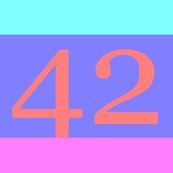
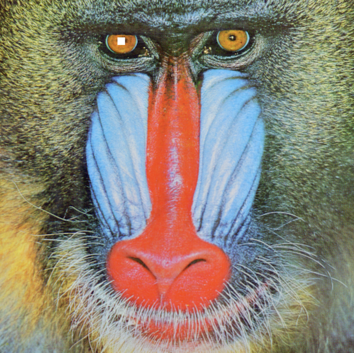
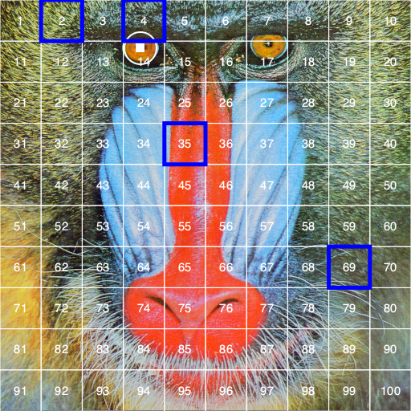

```@meta
DocTestSetup = quote
    using Luxor, Colors
    end
```
# Placing images

## Loading and placing images on drawings

Luxor lets you place existing images on the drawing. First, load the image:

- for PNG images, use `readpng(filename)`
- for SVG images, use `readsvg(filename)` or `readsvg(string)`
- for EPS images, use `placeeps(filename)`

(JPEGs aren't supported.)

Then use [`placeimage`](@ref) to place the image by its top
left corner at point `pt`, or use the `centered=true`
keyword to place the image's center point there. Access the
image's dimensions with `.width` and `.height`.

```@example
using Luxor # hide
Drawing(600, 350, "../assets/figures/images.png") # hide
origin() # hide
background("grey40") # hide
img = readpng("../assets/figures/julia-logo-mask.png")
w = img.width
h = img.height
rulers()
scale(0.3, 0.3)
rotate(π/4)
placeimage(img, Point(-w/2, -h/2), .5)
sethue("red")
circle(-w/2, -h/2, 15, :fill)
finish() # hide
nothing # hide
```


PNG images can be placed with varying opacity or transparency.

[`readsvg`](@ref) also lets you supply raw (or pure) SVG code in a string.

You can also use `placeimage()` to place an array of RGB or RGBA pixels on a drawing.

```@example
using Luxor, Colors # hide
N = 500
i = reshape([RGBA(rand(4)...) for p in 1:N^2], N, N)
# is is Matrix{RGBA{Float64}} 
# (alias for Array{RGBA{Float64}, 2})
@draw begin
  origin()
  sethue("orange")
  box(O, N/2, N/2, :fill)
  placeimage(i, O, centered=true, alpha=0.5)
end 500 500
```

Or load an image as an array and place it on a drawing.

```julia
using Luxor, Colors, FileIO
img = load(dirname(dirname(pathof(Luxor))) * "/docs/src/assets/figures/42.png")
@draw begin
    img[1:50, :] .= colorant"cyan"
    img[200:end, :] .= colorant"magenta"
    placeimage(img, O, centered=true, alpha=0.5)
end 250 250
```



## SVG images

To create an SVG image, using the `Drawing(... :svg)` or specify an SVG filename.
To obtain the SVG source of a completed drawing, use [`svgstring`](@ref).

For example, draw the Julia logo:

```julia
Drawing(500, 500, :svg)
origin()
julialogo()
finish()
s = svgstring()
```

The SVG source code is now stored in `s`. You can examine or process it further:

```julia
eachmatch(r"rgb\\(.*?\\)", s) |> collect
5-element Vector{RegexMatch}:
 RegexMatch("rgb(0%,0%,0%)")
 RegexMatch("rgb(79.6%,23.5%,20%)")
 RegexMatch("rgb(25.1%,38.8%,84.7%)")
 RegexMatch("rgb(58.4%,34.5%,69.8%)")
 RegexMatch("rgb(22%,59.6%,14.9%)")
```

To display the image in a Jupyter or Pluto notebook, use the `HTML` function, or you can use the [`readsvg`](@ref) and [`placeimage`](@ref) functions in combination.

## EPS images

EPS (Encapsulated PostScript) files created by Luxor (or any Cairo-based package) can be re-imported and placed on the current drawing with the [`placeeps`](@ref) function. The EPS commands are converted to the equivalent Luxor commands and evaluated immediately in the context of the current drawing and context.

!!! warning
    
    This function is designed to extract just the coordinates of paths from an EPS
    file. An EPS file can contain much more information about an image than just the
    coordinates: there's image and pixel data, font data, linear color gradients,
    and so on. These are not translated into Luxor functions. This function
    interprets some of the EPS commands in a Cairo-generated EPS "Prolog"; EPS files created
    by other applications will likely not contain this Cairo-generated Prolog, and
    so won't be interpreted at all (or will go wrong in interesting ways).

In the next example, an SVG file is placed and exported to an EPS file, then the EPS file is imported and placed on a new drawing with Luxor functions instead of EPS commands. It's placed at an angle for no good reason. When saved as SVG, the graphics will be in SVG format again. Some losses are to be expected!

```@example
using Luxor

svgfile = dirname(@__FILE__) * "../assets/figures/linux.svg"
epsfile = dirname(@__FILE__) * "../assets/figures/linux.eps"

@eps begin
    img = readsvg(svgfile)
    placeimage(img, centered = true)
end 500 500 epsfile
    
@drawsvg begin
    translate(boxtopleft())
    scale(0.5)
    rotate(π/12)
    placeeps(epsfile)
end 
```

If you want to obtain the paths and coordinates for use elsewhere, you can use the `log=true` function, which sends the commands to the REPL as well:

```julia
placeeps("/tmp/linux.eps", log=true)

# start EPS import
gsave()
setgray(1.0)
move(Point(70.801, -6.0))
line(Point(429.199, -6.0))
curve(Point(471.617, -6.0), Point(506.0, 28.383), Point(506.0, 70.801))
line(Point(506.0, 429.199))
curve(Point(506.0, 471.617), Point(471.617, 506.0), Point(429.199, 506.0))
line(Point(70.801, 506.0))
curve(Point(28.383, 506.0), Point(-6.0, 471.617), Point(-6.0, 429.199))
line(Point(-6.0, 70.801))
curve(Point(-6.0, 28.383), Point(28.383, -6.0), Point(70.801, -6.0))
closepath()
move(Point(70.801, -6.0))
fillpath()
...
```

Once you have the Luxor commands, you can edit them into new creations:


## Placing an image matrix

You can also use [`placeimage`](@ref) to put image matrices on a drawing.

```julia
using Luxor

mat = @imagematrix begin    
    juliacircles(6)
end 40 40

@draw begin
    for i in 1:500
        pos = rand(BoundingBox())
        @layer begin
            translate(pos)
            rotate(rand() * 2π)
            placeimage(mat, centered = rand(Bool))
        end
    end
end
```


[`placeimage`](@ref) can also take in an optional argument `alpha` to change the opacity of the image matrix.


## Clipping images

You can clip images. The following script repeatedly places the image using a circle to define a clipping path:


```julia
using Luxor

width, height = 4000, 4000
margin = 500

fname = "test-image.pdf"
Drawing(width, height, fname)
origin()
background("grey25")

setline(5)
sethue("green")

image = readpng(dirname(@__FILE__) * "../assets/figures/julia-logo-mask.png")

w = image.width
h = image.height

pagetiles = Tiler(width, height, 7, 9)
tw = pagetiles.tilewidth/2
for (pos, n) in pagetiles
    circle(pos, tw, :stroke)
    circle(pos, tw, :clip)
    gsave()
    translate(pos)
    scale(.95, .95)
    rotate(rand(0.0:π/8:2π))
    placeimage(image, O, centered=true)
    grestore()
    clipreset()
end

finish()
```

## Transforming images

You can transform images by setting the current matrix, either with [`scale`](@ref) and [`rotate`](@ref) and similar, or by modifying it directly. This code scales and rotates an image made in an earlier chapter of this document around in a circle:

```@example
using Luxor # hide
Drawing(600, 400, "../assets/figures/transform-images.png") # hide
origin() # hide
img = readpng(dirname(dirname(pathof(Luxor))) * "/docs/src/assets/figures/textoutlines.png")
w = img.width
h = img.height
for θ in 0:π/6:2π-π/6
    gsave()
    scale(.4, .4)
    rotate(θ)
    translate(300, 0)
    placeimage(img, -w/2, -h/2, 0.9)
    grestore()
end
finish() # hide
nothing # hide
```


## Combining images and vector graphics

You sometimes want to combine vector graphics and images, for example, to annotate them with text or vector graphics.

There are two ways you can do this: 

- by adding the image with `placeimage()` and then drawing vector graphics on top. 

- by opening the image as a drawing, and adding vector graphics into the image. 

The things to be aware of are mostly to do with coordinates and transforms.

### Adding graphics on top

In this example, we'll annotate a PNG file.

```@example
using Luxor # hide

image = readpng("../assets/figures/julia-logo-mask.png")

w = image.width
h = image.height

# create a drawing surface of the same size

fname = "../assets/figures/drawing_on_images.png"
Drawing(w, h, fname)

# place the image on the Drawing - it's positioned by its top/left corner

placeimage(image, 0, 0)

# now you can annotate the image. The (0/0) is at the top left.

sethue("red")
setline(1)
fontsize(16)
circle(Point(150, 50), 2, :fill)
label("(150/50)", :NE, Point(150, 50), leader=true, offset=25)

arrow(Point(w/2, 90), Point(0, 90))
arrow(Point(w/2, 90), Point(w, 90))
text("width $w", Point(w/2, 70), halign=:center)

# to divide up the image into rectangular areas and number them,
# temporarily position the axes at the center:

@layer begin
  setline(0.5)
  sethue("green")
  fontsize(12)
  translate(w/2, h/2)
  tiles = Tiler(w, h, 8, 8, margin=0)
  for (pos, n) in tiles
      box(pos, tiles.tilewidth, tiles.tileheight, :stroke)
      text(string(n-1), pos, halign=:center)
  end
end
finish() # hide
nothing # hide
```


#### Adding text to transformed placed images

The above approach works well, but suppose you want to locate the working origin
at the lower left of the image, i.e. you want all coordinates to be relative to the
bottom left corner of the image?

To do this, use [`translate`](@ref) and [`transform`](@ref) to modify the drawing space:

```@example
using Luxor # hide

image = readpng("../assets/figures/julia-logo-mask.png")
w = image.width
h = image.height
fname = "../assets/figures/drawing_on_images_2.png"
Drawing(w, h, fname)
placeimage(image, 0, 0)

# Move the axes to the bottom:

translate(0, h)

# and reflect in the x-axis

transform([1 0 0 -1 0 0])

# now 0/0 is at the bottom left corner, and 100/100 is up and to the right.

sethue("blue")
arrow(Point(200, 300), Point(160, 300))

# However, don't draw text while flipped, because it will be reversed!

fontsize(20)
sethue("black")
text("Oh no!", Point(30, 250))

# To work around this, define a text function
# that flips the workspace over the x-axis just for the text:

function textoverlay(t, pos; kwargs...)
    @layer begin
        translate(pos)
        transform([1 0 0 -1 0 0])
        text(t, O; kwargs...)
    end
end

textoverlay("a tittle!", Point(200, 300), halign=:left, valign=:middle)
textoverlay("0/0", O)
arrow(Point(130, 400), Point(130, 340))

finish() # hide

finish() # hide
nothing # hide
```


### Opening the image as drawing

An alternative way to work with images is to open the image as a drawing. Let's open the well-known mandrill image in Luxor. (I'll call him Marvin, because I couldn't find out whether or not the model had a name, but I think he should have one.)

```julia
using Luxor, Colors, Images, TestImages

marvin = testimage("mandrill")
M = Luxor.Colors.ARGB32.(marvin)
Drawing(M)
```

The current drawing is now a 512 × 512 array, where each pixel is an ARGB32 (an unsigned 32-bit integer holding 4 8-bit vaalues).

Marvin's right eye (on the left side of the drawing) is located at about 60 rows down, 175 columns across. Let's fill in his pupil with a white square:

```julia
M[55:65, 170:180] .= colorant"white"
M
```



Using `M` on its own should show the image in your notebook or code editor (but not the REPL). If you want to save it, using the standard Images.jl functions.

We can use these indices as x and y coordinates, since the drawing origin is also currently at the top left.

```julia
sethue("white")
circle(Point(60, 175), 20, :stroke)
M
```

If we want to draw, say, a 10 by 10 numbered grid overlay on top of Marvin, and highlight four numbered cells, it's easier to just add a `transform()` function that flips the x/cols and y/rows convention, then create a table centered at the center of the drawing:

```julia
fontsize(15)
sethue("white")
setline(1)
transform([0 1 1 0 0 0])
cells = Table(10, 10, 512 / 10, 512 / 10, Point(512 / 2, 512 / 2))
for (pos, n) in cells
    text(string(n), pos, halign = :center, valign = :middle)
    box(pos, 512 / 10, 512 / 10, :stroke)
end
setline(5)
highlightcells(cells, collect(1:100)[[2, 4, 35, 69]], :stroke, 
    color = colorant"blue")
M
```



## Image compositing

You should be using [Images.jl](https://github.com/JuliaImages) for most tasks involving image editing. But if you just need to composite images together, you can use the blending modes provided by [`setmode`](@ref).

```@example
using Luxor # hide
Drawing(600, 400, "../assets/figures/image-compositing.png") # hide
origin() # hide
img = readpng("../assets/figures/textoutlines.png")
w = img.width
h = img.height

placeimage(img, -w/2, -h/2, .5)
setmode("saturate")
translate(50, 0)
placeimage(img, -w/2, -h/2, .5)

finish() # hide
nothing # hide
```


