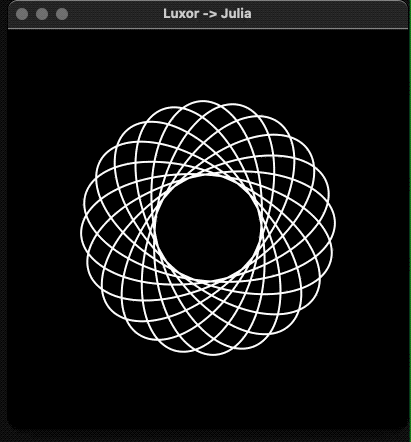
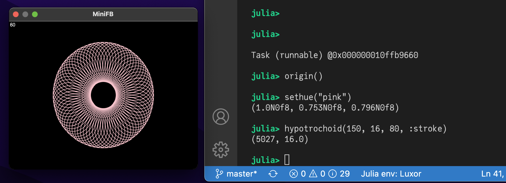
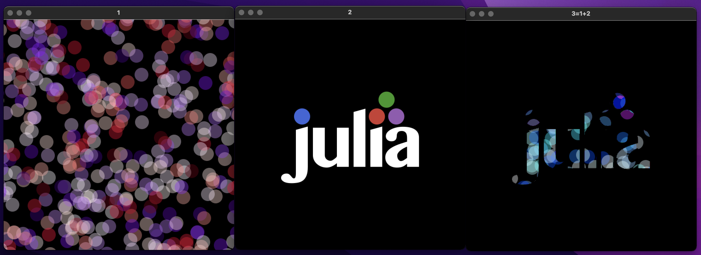
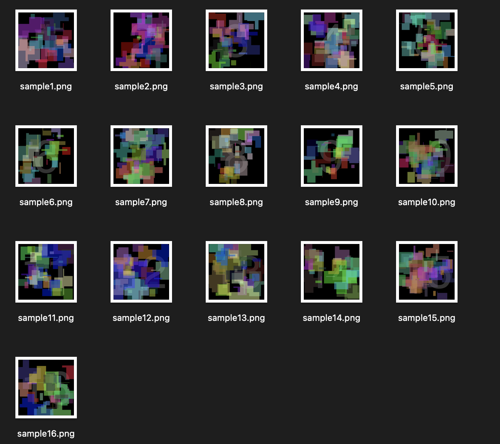

# Interactive graphics and Threads

## Continuous display

With the help of an external appication to manage windows, it's possible to use Luxor to create continuously changing graphics in a window.

### The `@play` macro

This example uses the [MiniFB](https://github.com/aviks/MiniFB.jl) package, which you can add using `] add MiniFB`.

The file `play.jl` defines a simple macro, `@play`, which continuously evaluates and draws the graphics in a window. For example, this code:

```julia
using Luxor

include(dirname(pathof(Luxor)) * "/play.jl")

let θ = 0
    @play 400 400 begin
    #
        background("black")
        sethue("white")
        rotate(θ)
        hypotrochoid(200, 110, 37, :stroke)
        θ += π/120
        sleep(0.01)
    #
    end
end
```

draws a continuously rotating hypotrochoid.



### Clock

This code also imports the `@play` macro.

The call to `sleep` reduces the CPU time, and allows other processes to run, but the millisecond
animation will be less smooth as a result.


```julia
using Luxor, Colors, Dates, ColorSchemes

include(dirname(pathof(Luxor)) * "/play.jl")

function clock(cscheme=ColorSchemes.leonardo)
    @play 400 600 begin

        # background
        sethue(get(cscheme, .0))
        paint()

        # 24hour sector
        fontsize(30)
        sethue(get(cscheme, .2))
        h = Dates.hour(now())
        sector(O, 180, 200, π/2, π/2 + rescale(h, 0, 24, 0, 2pi), :fill)

        @layer begin
            fontsize(12)
            sethue("white")
            @. text(["0", "6", "12", "18"], polar(190, [i * π/2 for i in 1:4]),
                halign=:center,
                valign=:middle)
        end

        # minute sector
        sethue(get(cscheme, .4))
        m = Dates.minute(now())
        sector(O, 160, 180, 3π/2, 3π/2 + rescale(m, 0, 60, 0, 2pi), :fill)

        # second sector
        sethue(get(cscheme, .6))
        s = Dates.second(now())
        sector(O, 140, 160, 3π/2, 3π/2 + rescale(s, 0, 60, 0, 2pi), :fill)

        # millisecond indicator
        @layer begin
            setopacity(0.5)
            sethue(get(cscheme, .8))
            ms = Dates.value(Dates.Millisecond(Dates.now()))
            circle(polar(120, 3π/2 + rescale(ms, 0, 1000, 0, 2pi)), 20, :fill)
        end

        # central text
        fontface("JuliaMono-Black")
        sethue(get(cscheme, 1.0))
        text(Dates.format(Dates.now(), "HH:MM:SS"), halign=:center)

        sleep(0.05)
    end
end

clock(ColorSchemes.klimt)
```

## Live coding with MiniFB

Here are some examples of how to use Luxor with MiniFB as the display window, without using the simple `@play` macro.

### Interactivity

This example lets you type graphic commands at the REPL and see the results instantly displayed in a window.

First, run this code to connect a Luxor drawing to a MiniFB buffer:

```julia
using Luxor
using Colors
using MiniFB

function window_update_task(window, buffer, showFPS=false)
    state = mfb_update(window, buffer)
    updateCount = 0
    startTime = floor(Int, time())
    fps = "0"
    while state == MiniFB.STATE_OK
        if showFPS
            elapsedTime = floor(Int, time()) - startTime
            if elapsedTime > 1
                fps = string(round(Int, updateCount / elapsedTime))
                startTime = floor(Int, time())
                updateCount = 0
            end
            @layer begin
                setcolor("black")
                circle(boxtopleft() + (15, 15), 15, :fill)
                setcolor("white")
                fontsize(20)
                text(fps, boxtopleft() + (15, 15), halign=:center, valign=:middle)
            end
        end
        state = mfb_update(window, buffer)
        sleep(1.0 / 120.0)
        updateCount += 1
    end
    println("\nWindow closed\n")
end

const WIDTH = 800
const HEIGHT = 600

buffer = zeros(ARGB32, WIDTH, HEIGHT)
d = Drawing(buffer)
window = mfb_open_ex("MiniFB", WIDTH, HEIGHT, MiniFB.WF_RESIZABLE)
@async window_update_task(window, buffer, true)
```

Now, the window will display the results of any expressions you type at the REPL:



### Live animations

If you want to do live animations in the window in a "while" loop, you need to call `sleep()` for a while to allow the `window_update_task()` to get some execution time. 

In this example you can enter "q" and "return" in the REPL to stop the animation's while loop. Using "ctrl-c" to stop the animation could also stop the window update task by chance.


```@raw html
<details closed><summary>Code for this example</summary>
```

```julia
mutable struct Ball
    position::Point
    velocity::Point
end
function sticks(w, h)
    channel = Channel(10)
    #enter "q" and "return" to stop the while loop
    @async while true
        kb = readline(stdin)
        if contains(kb, "q")
            put!(channel, 1)
            break
        end
    end
    colors = [ rand(1:255), rand(1:255), rand(1:255) ]
    newcolors  = [ rand(1:255), rand(1:255), rand(1:255) ]
    c = ARGB(colors[1]/255, colors[2]/255, colors[3]/255, 1.0)
    balls = [ Ball( rand(BoundingBox(Point(-w/2, -h/2), Point(w/2, h/2))), rand(BoundingBox(Point(-10, -10), Point(10, 10))) ) for _ in 1:2 ] 
    while true
        background(0, 0, 0, 0.05)
        if colors == newcolors
            newcolors = [ rand(1:255), rand(1:255), rand(1:255) ]
        end
        for (index, (col, newcol)) in enumerate(zip(colors, newcolors))
            if col != newcol
                col > newcol ? col -= 1 : col += 1
                colors[index] = col
            end
        end
        c = ARGB(colors[1]/255, colors[2]/255, colors[3]/255, 1.0)
        for ball in balls
            if !(-w/2 < ball.position.x < w/2)
                ball.velocity = Point(-ball.velocity.x, ball.velocity.y)
            end
            if !(-h/2 < ball.position.y < h/2)
                ball.velocity = Point(ball.velocity.x, -ball.velocity.y)
            end
            ball.position = ball.position + ball.velocity
        end
        setcolor(c)
        line(balls[1].position, balls[2].position, :stroke)
        sleep(1.0/120.0)
        if isready(channel)
            break
        end
    end
end

origin()
sticks(WIDTH, HEIGHT)
```

```@raw html
</details>
```

### Interactive graphics with multiple drawings

This next example shows how to work with multiple drawings. We'll create three windows, then combine (`AND`) the contents of the first two and display them in the third.



First, we'll setup our display buffers and MiniFB windows, one for each Luxor drawing:

```julia
using MiniFB, Luxor, Colors, FixedPointNumbers

WIDTH=500
HEIGHT=500

function window_update_task(window,buffer)
    state=mfb_update(window,buffer)
    while state == MiniFB.STATE_OK
        state=mfb_update(window,buffer)
        sleep(1.0/120.0)
    end
    println("\nWindow closed\n")
end

window1 = mfb_open_ex("1", WIDTH, HEIGHT, MiniFB.WF_RESIZABLE)
buffer1 = zeros(ARGB32, WIDTH, HEIGHT)
@async window_update_task(window1,buffer1)

window2 = mfb_open_ex("2", WIDTH, HEIGHT, MiniFB.WF_RESIZABLE)
buffer2 = zeros(ARGB32, WIDTH, HEIGHT)
@async window_update_task(window2,buffer2)

window3 = mfb_open_ex("3=1+2", WIDTH, HEIGHT, MiniFB.WF_RESIZABLE)
buffer3 = zeros(ARGB32, WIDTH, HEIGHT)
@async window_update_task(window3,buffer3)
```

Buffers 1, 2, and 3 are the buffers for the three MiniFB windows. They'll appear on your display.

Next we'll create three Luxor drawings that connect to these buffers.

```julia
d1 = Drawing(buffer1)    

Luxor.set_next_drawing_index()   
d2 = Drawing(buffer2)

Luxor.set_next_drawing_index()   
d3 = Drawing(buffer3, "julia.png")
```

We now have three drawings which are continuously updated and visible in three separate windows.
Let's start by drawing on drawing 1.

```julia
Luxor.set_drawing_index(1) 
origin()
setopacity(0.4)
foregroundcolors = Colors.diverging_palette(
    rand(0:360), 
    rand(0:360), 
    200, s=0.99, b=0.8)
gsave()
for i in 1:500
    sethue(foregroundcolors[rand(1:end)])
    circle(Point(rand(-300:300), rand(-300:300)), 15, :fill)
end
grestore()
```

Now let's switch to drawing 2 and draw the Julia logo:

```julia
Luxor.set_drawing_index(2)
origin()
setopacity(1.0)
gsave()
julialogo(centered=true, bodycolor=colorant"white")
grestore()
```

Finally, we'll switch to drawing 3, and set its contents by ANDing the buffers of drawings 1 and 2:

```julia
Luxor.set_drawing_index(3)  
background("black")
buffer3 .= reinterpret(ARGB{N0f8}, 
    (reinterpret.(UInt32,buffer1) .& 
     reinterpret.(UInt32,buffer2)))
```

To finish, we'll set the opacity of each pixel to 1.0:

```julia
buffer3.=ARGB32.(RGB24.(buffer3))

finish()
preview()
```

## Threads

Luxor is thread safe. To run the examples below, [start Julia with more than 1 thread](https://docs.julialang.org/en/v1/manual/multi-threading/#Starting-Julia-with-multiple-threads). To see how many threads you have available, ask Julia:

```julia
julia> Threads.nthreads()
4
```

As a first example, we'll produce multiple PNG files in parallel:

```julia
using Luxor # hide

tempdir = mktempdir(; cleanup=false)
cd(tempdir)

function make_drawings(i::Int)
    println("Working on thread ", Threads.threadid())
    w = 300
    h = 300
    filename = "sample" * string(i) * ".png"
    Drawing(w, h, filename)
    origin()
    background("black")
    setopacity(0.5)
    fontsize(250)
    sethue("grey40")
    text(string(i), halign=:center, valign=:middle)
    for k in 1:50
        pg1 = polycross(rand(BoundingBox()), rand(60:120), 4, vertices=true)
        pg2 = polycross(rand(BoundingBox()), rand(60:120), 4, vertices=true)
        pg3 = polyintersect(pg1, pg2)
        for p in pg3
            randomhue()
            poly(p, :fill)
        end
    end
    finish()
    return
end

Threads.@threads for i = 1:(2*Threads.nthreads())
    make_drawings(i)
end

Working on thread 2
Working on thread 3
Working on thread 4
Working on thread 2
Working on thread 1
Working on thread 3
Working on thread 1
Working on thread 4
```



## Advanced threads with live view

To demonstrate what is possible, we again show live graphics in MiniFB windows, 
but this time in different threads.

There are two ways to use threads with Luxor. 

One way is to use a single thread for
each window we want to show, i.e each window we spawn and the Luxor graphics inside
is a different thread. 

The other way to use threads is e.g. a single window, with
several threads all drawing into the same buffer, which is shown in the single window.
For this you need to utilize locks as shown in the second example below.

### A thread for each window

First, here's an example where each window and its graphics is
a single thread. No locks or channels are needed.

Let's start with the header and a helper function for our animation:

```julia
using ThreadPools
# the low level Threads.@spawn macro can not be used, because threads are scheduled
# randomly into available threadids. If a thread is spawned into an already running 
# threadid, the former thread # is closed by the scheduler. So we use the better 
# ThreadPools.spawnbg to spawn the threads.

using MiniFB, Luxor, Colors, FixedPointNumbers

mutable struct Ball
    position::Point
    velocity::Point
end

function step_ball(ball, w, h, r)
    if ball.position.x - r < -w / 2 || ball.position.x + r > w / 2
        ball.velocity = Point(-ball.velocity.x, ball.velocity.y)
    end
    if ball.position.y - r < -h / 2 || ball.position.y + r > h / 2
        ball.velocity = Point(ball.velocity.x, -ball.velocity.y)
    end
    ball.position = ball.position + ball.velocity
    return ball
end
```

Open and run the first window in its own thread:

```julia
function window_ball()
    w=500
    h=500
    r=50
    buffer = zeros(RGB24, w, h)
    ball=Ball(Point(0, 0), rand(BoundingBox(Point(-10, -10), Point(10, 10))))
    Drawing(buffer)
    origin()
    window = mfb_open_ex("Ball", w, h, MiniFB.WF_RESIZABLE)
    state = MiniFB.STATE_OK
    while state == MiniFB.STATE_OK
        ball=step_ball(ball, w, h, r)
        background(0.0, 0.0, 0.0, 1.0)
        setcolor("red")
        circle(ball.position.x, ball.position.y, r, :fill)
        state=mfb_update(window, buffer)
        sleep(1.0/120.0)
    end
    println("\nWindow closed\n")
end
spawnbg(window_ball)
```

Open and run a second window in its own thread:

```julia
function window_stick()
    w=500
    h=500
    r=0
    buffer = zeros(RGB24, w, h)
    balls=[Ball(rand(BoundingBox(Point(-w/2, -h/2), 
        Point(w/2, h/2))), 
        rand(BoundingBox(Point(-10, -10), Point(10, 10)))) for _ in 1:2] 
    Drawing(buffer)
    origin()
    background(0.0,0.0,0.0,1.0)
    window = mfb_open_ex("Sticks", w, h, MiniFB.WF_RESIZABLE)
    state = MiniFB.STATE_OK
    while state == MiniFB.STATE_OK
        background(0.0, 0.0, 0.0, 0.05)
        setcolor("green")
        for ball in balls
            ball=step_ball(ball, w, h, r)
        end
        line(balls[1].position, balls[2].position, :stroke)
        state=mfb_update(window, buffer)
        sleep(1.0/120.0)
    end
    println("\nWindow closed\n")
end
spawnbg(window_stick)
```

If you have threads left you can start another thread with a third window:

```julia
spawnbg(window_stick)
```

If you run out of threadids, the command `spawnbg(window_stick)` will block
the REPL until a thread is freed, e.g. by closing one of the windows.

### A single window with graphics of several threads

The next example shows a single window/buffer where several threads are
drawing into it. This needs some extra caution by utilizing locks, because
every thread uses the same drawing buffer. Therefore all drawing
commands needs to be synchronized with `lock`/`unlock`:

```julia
using ThreadPools

using MiniFB, Luxor, Colors

struct Window
    c::ReentrantLock
    w::Int
    h::Int
    d::Drawing
    buffer::Matrix{ARGB32}
    function Window(w,h)
        c=ReentrantLock()
        b=zeros(ARGB32, w, h)
        d=Drawing(b)
        origin()
        new(c,w,h,d,b)
    end
end

function window_update_task(win::Window, showFPS=true)
    w=win.w
    h=win.h
    updateCount=0
    startTime=floor(Int, time())
    fps="0"
    sb=zeros(ARGB32, 105, 55)
    window = mfb_open_ex("MiniFB", w, h, MiniFB.WF_RESIZABLE)
    state=MiniFB.STATE_OK
    set_drawing = true
    while state == MiniFB.STATE_OK
        lock(win.c)
        if set_drawing
            currentdrawing(win.d)
            set_drawing = false
        end
        if showFPS
            elapsedTime=floor(Int,time())-startTime
            if elapsedTime > 1
                fps=string(round(Int,updateCount/elapsedTime))
                startTime=floor(Int,time())
                updateCount=0
            end
            sb.=win.buffer[1:105, 1:55]
            @layer begin
                (dx,dy) = Point(0.0, 0.0) - getworldposition(Point(0.0, 0.0);centered=false)
                setcolor(1.0, 0, 0, 0.5)
                fontsize(50)
                text(fps, Point(5+dx, 5+dy), halign=:left, valign = :top)
            end
        end
        state=mfb_update(window,win.buffer)
        if showFPS
            win.buffer[1:105, 1:55].=sb
        end
        background(0, 0, 0, 0.05)
        unlock(win.c)
        sleep(1.0/120.0)
        updateCount+=1
    end
    println("\nWindow closed\n")
end
```

That's all we need to define a window with a fps display. Let's define it and run it as a new thread:

```julia
win = Window(800, 600)    # the window definition

# we need a function without parameter, that's what we create here:
let window=win
   global t_window_update_task
   function t_window_update_task()
       window_update_task(window)
   end
end

# run the task as a new thread:
spawnbg(t_window_update_task)
```

The window with a FPS display shows up. It runs in its own thread so we can still
use the REPL to create new threads which draw into this window. The most important
special code here is:

```julia
currentdrawing(win.d)
```

We start a new thread for every drawing and because the Luxor drawings of different
threads are separated from each other to ensure thread safety, we overwrite the
drawing in each thread with the drawing started with

```julia
win=Window(800, 600)
```

and stored in the `win`-object. See the constructor in `struct Window`.

Let's show it:

```julia
mutable struct Ball
    position::Point
    velocity::Point
end

function stick(win)
    w = win.w
    h = win.h
    colors = [rand(1:255), rand(1:255), rand(1:255)]
    newcolors = [rand(1:255), rand(1:255), rand(1:255)]
    c = ARGB(colors[1] / 255, colors[2] / 255, colors[3] / 255, 1.0)
    balls = [Ball(
        rand(BoundingBox(Point(-w / 2, -h / 2), Point(w / 2, h / 2))), 
        rand(BoundingBox(Point(-10, -10), Point(10, 10)))) 
            for _ in 1:2]
    set_drawing = true
    while true
        if colors == newcolors
            newcolors = [rand(1:255), rand(1:255), rand(1:255)]
        end
        for (index, (col, newcol)) in enumerate(zip(colors, newcolors))
            if col != newcol
                col > newcol ? col -= 1 : col += 1
                colors[index] = col
            end
        end
        c = ARGB(colors[1] / 255, colors[2] / 255, colors[3] / 255, 1.0)
        for ball in balls
            if !(-w / 2 < ball.position.x < w / 2)
                ball.velocity = Point(-ball.velocity.x, ball.velocity.y)
            end
            if !(-h / 2 < ball.position.y < h / 2)
                ball.velocity = Point(ball.velocity.x, -ball.velocity.y)
            end
            ball.position = ball.position + ball.velocity
        end
        lock(win.c)
        if set_drawing
            currentdrawing(win.d)
            set_drawing = false
        end
        setcolor(c)
        line(balls[1].position, balls[2].position, :stroke)
        unlock(win.c)
        sleep(1.0 / 60.0)
    end
end

# again a function for calling without parameter:
let window=win
   global t_stick
   function t_stick()
       stick(window)
   end
end

# run the thread and let the sticks fly:
spawnbg(t_stick)
```

Because our threads are synchronized via `lock`/`unlock` we can spawn
low-level threads as much as we want and our machine allows:

```julia
function spawn_many()
    tid=1:Threads.nthreads()
    for i in tid
        t=Task(t_stick)
        ccall(:jl_set_task_tid, Cvoid, (Any, Cint), t, i-1)
        schedule(t)
    end
end
```

Now you can repeat it as much as you dare:

```julia
spawn_many()
```
